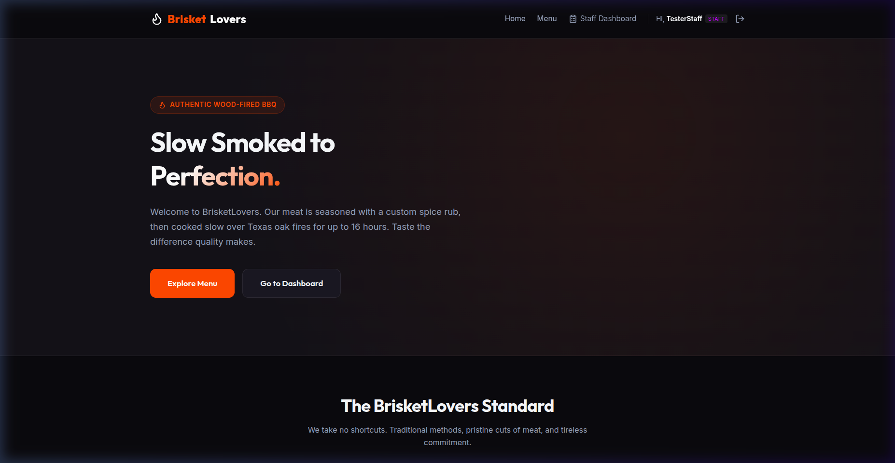
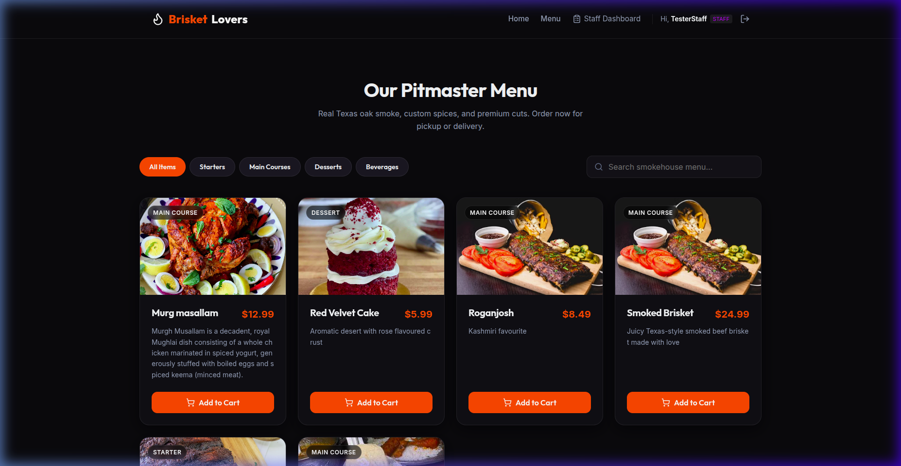
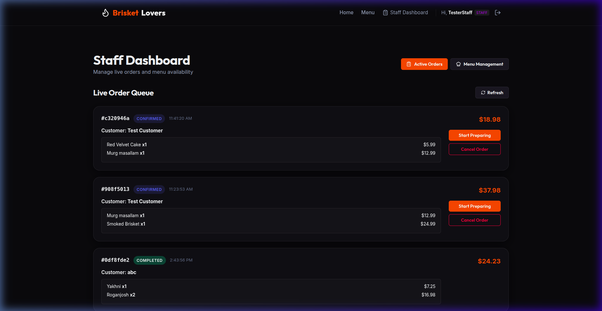

<h1 align="center">🍖 BrisketLovers Restaurant Management System</h1>

<p align="center">
  A full-stack web application for managing a BBQ restaurant — from customer ordering to kitchen operations to superadmin oversight.
</p>

<p align="center">
  
  
  
  
  
</p>

---

## 📋 Table of Contents

- [Project Overview](#-project-overview)
- [Tech Stack](#-tech-stack)
- [Architecture](#-architecture)
- [Screenshots](#-screenshots)
- [Getting Started (Clone & Run)](#-getting-started-clone--run)
- [Environment Variables](#-environment-variables)
- [How the Website Works](#-how-the-website-works)
  - [Customer Flow](#1-customer-flow)
  - [Staff Flow](#2-staff-flow)
  - [Superadmin Flow](#3-superadmin-flow)
- [Role & Permissions Matrix](#-role--permissions-matrix)
- [API Overview](#-api-overview)
- [Database Schema](#-database-schema)
- [Default Test Accounts](#-default-test-accounts)
- [Known Limitations & Future Improvements](#-known-limitations--future-improvements)

---

## 🗂 Project Overview

**BrisketLovers** is a digital restaurant management platform for a BBQ smokehouse. It replaces manual, paper-based operations with a unified system covering:

| Domain | What it does |
|---|---|
| **Customer Portal** | Browse menu, manage cart, place orders, track status, pay online |
| **Kitchen/Staff Dashboard** | Manage order queue in real-time, manage menu items and recipes |
| **Superadmin Control Center** | Analytics, staff management, inventory, audit logs |

### High-Level Workflow

```
Customer → Register → Browse Menu → Add to Cart → Checkout
  → Place Order → Payment (Mock / Stripe)
    → Staff: Confirmed → Preparing → Ready → Completed
      → Auto-deduct Ingredients → Update Dish Availability
        → Superadmin: Analytics, Audit Logs, Inventory
```

---

## 🛠 Tech Stack

### Backend

| Technology | Version | Purpose |
|---|---|---|
| **NestJS** | v11 | Modular REST API framework |
| **TypeScript** | ^5.7 | Type safety across all backend code |
| **PostgreSQL** | Latest | Primary relational database |
| **TypeORM** | ^0.3.28 | ORM with entity mapping and relations |
| **JWT + Passport** | — | Stateless auth (access + refresh tokens) |
| **bcryptjs** | ^3.0 | Password hashing |
| **Multer** | ^2.1 | Menu image uploads |
| **Stripe** | ^22.2 | Payment integration (mock fallback for dev) |
| **Swagger** | — | Auto-generated API docs at `/api` |
| **class-validator** | ^0.14 | DTO input validation |

### Frontend

| Technology | Version | Purpose |
|---|---|---|
| **React** | v19 | UI component library |
| **TypeScript** | ~6.0 | Type safety |
| **Vite** | v8 | Build tool & dev server |
| **React Router** | v7 | Client-side routing + protected routes |
| **Axios** | ^1.17 | HTTP client with auth interceptors |
| **Lucide React** | — | Icon library |
| **Stripe.js** | — | Frontend payment integration |
| **Vanilla CSS** | — | Custom styling (no CSS framework) |

---

## 🏗 Architecture

### Backend — Modular NestJS

```
src/
├── core/                   # Shared infrastructure
│   ├── auth/               # JWT generation & refresh strategy
│   ├── guards/             # JwtAuthGuard + RolesGuard
│   ├── decorators/         # @CurrentUser(), @Roles()
│   ├── crypto/             # bcrypt password hashing
│   ├── seed/               # Auto-seed superadmin on startup
│   └── global.constraints  # All enums (Role, OrderStatus, Category…)
├── users/                  # User & staff CRUD, login, registration
├── menu/                   # Menu item CRUD, image upload, audit logs
├── cart/                   # Persistent server-side cart
├── orders/                 # Full order lifecycle management
├── payments/               # Stripe + mock payment flow
├── analytics/              # Dashboard metrics aggregation
└── inventory/              # Ingredients, recipes, stock management
```

### Frontend — Feature-Based React SPA

```
frontend/src/
├── contexts/               # AuthContext, CartContext, ToastContext
├── services/api.ts         # Axios instance with token refresh interceptors
├── components/             # Navbar, Footer, ProtectedRoute
└── pages/
    ├── common/             # Login, Register, Unauthorized
    ├── customer/           # Home, Menu, Cart, Checkout, Orders, Profile
    ├── staff/              # StaffDashboard (Active Orders + Menu Mgmt)
    └── admin/              # AdminDashboard, InventoryPage, RecipeModal
```

### Authentication Flow

```
POST /api/users/login
  → bcrypt.compare(password, hash)
  → Returns: { accessToken (1d), refreshToken (7d), user }
  → Frontend stores tokens in localStorage

Every request → Authorization: Bearer <accessToken>
  → JwtAuthGuard validates token
  → RolesGuard checks user.role

On 401 → Axios interceptor → POST /api/auth/refresh → retry original request
On refresh failure → logout + clear localStorage
```

---

## 📸 Screenshots

### Home Page



### Menu Page



### Staff Dashboard



---

## 🚀 Getting Started (Clone & Run)

### Prerequisites

Make sure you have the following installed:

- **Node.js** >= 18.x
- **npm** >= 9.x
- **PostgreSQL** >= 14

### 1. Clone the Repository

```bash
git clone https://github.com/Sehrabdar/BrisketLovers.git
cd BrisketLovers
```

### 2. Set Up Environment Variables

Copy the sample env file and fill in your values:

```bash
cp sample.env .env
```

Then edit `.env` with your PostgreSQL credentials and secrets (see [Environment Variables](#-environment-variables) below).

Also set up the frontend env:

```bash
echo "VITE_API_URL=http://localhost:3000/api" > frontend/.env
```

### 3. Set Up the Database

Connect to PostgreSQL and create the database:

```sql
CREATE DATABASE "BrisketLovers";
```

> **Note:** TypeORM runs with `synchronize: true` in development — all tables are created automatically on first backend startup.

### 4. Install & Run the Backend

```bash
# From the project root
npm install
npm run start:dev
```

The backend will be available at: `http://localhost:3000`  
Swagger API docs: `http://localhost:3000/api`

> On first startup, a **superadmin account** is automatically seeded using the credentials in your `.env`.

### 5. Install & Run the Frontend

```bash
# In a separate terminal
cd frontend
npm install
npm run dev
```

The frontend will be available at: `http://localhost:5173`

### 6. Build for Production

```bash
# Backend
npm run build
npm run start:prod

# Frontend (from frontend/)
npm run build
npm run preview
```

---

## ⚙️ Environment Variables

### Backend (`.env` in project root)

```env
PORT=3000
CORS_ORIGIN=http://localhost:5173

# JWT
JWT_ACCESS_SECRET=your_access_secret_here
JWT_ACCESS_EXPIRES_IN=1d
JWT_REFRESH_SECRET=your_refresh_secret_here
JWT_REFRESH_EXPIRES_IN=7d
JWT_VERIFY_EXPIRES_IN=15m

# PostgreSQL
POSTGRES_HOST=localhost
POSTGRES_PORT=5432
POSTGRES_USERNAME=postgres
POSTGRES_PASSWORD=your_db_password
POSTGRES_DB=BrisketLovers

# Username generation
SLUG_LENGTH=18

# Superadmin seed (auto-created on first startup)
SUPERADMIN_EMAIL=admin@brisketlovers.com
SUPERADMIN_PASSWORD=Admin@123456
SUPERADMIN_NAME=Super Admin

# Stripe (use placeholder values for mock/dev mode)
STRIPE_SECRET_KEY=sk_test_placeholder
STRIPE_WEBHOOK_SECRET=whsec_placeholder

# File uploads
UPLOAD_DIR=./uploads
```

> **Stripe mock mode:** If `STRIPE_SECRET_KEY` is set to a placeholder, the system automatically falls back to a mock payment flow — no real Stripe account needed for local development.

### Frontend (`frontend/.env`)

```env
VITE_API_URL=http://localhost:3000/api
```

---

## 🌐 How the Website Works

The system has **three distinct user roles**, each with their own dedicated interface.

---

### 1. Customer Flow

**Route prefix:** `/` (public pages) and `/cart`, `/checkout`, `/orders`, `/profile`

#### Step 1 — Register / Login

- New customers register at `/register` with name, email, phone, and password.
- Existing users log in at `/login`.
- After login, customers are redirected to the **Home page** (`/`).

#### Step 2 — Browse the Menu

- Navigate to `/menu` to view all available dishes.
- Filter by **category** (Starter, Main Course, Dessert, Beverage).
- **Search** by dish name.
- Sort by name or date.
- Dishes marked as **out of stock** are automatically hidden from the available filter.

#### Step 3 — Add to Cart

- Click **"Add to Cart"** on any available dish.
- The cart persists server-side — it survives page refreshes.
- The cart badge in the Navbar updates in real time.
- Each cart item shows **available servings** (dynamically calculated from ingredient stock — accounts for other items in your cart sharing the same ingredients).

#### Step 4 — Checkout & Payment

- Go to `/cart` to review items, adjust quantities, or remove items.
- Click **"Proceed to Checkout"** to go to `/checkout`.
- Enter a delivery address and optional notes.
- Click **"Place Order & Proceed to Payment"** — this:
  1. Validates ingredient stock
  2. Creates the order with price/name snapshots
  3. Clears the cart
  4. Redirects to the payment step
- **Mock payment** (dev mode): fill in any card details and click "Pay & Confirm Order" — payment is confirmed instantly.
- **Real Stripe** (production): uses Stripe Elements + webhook for payment confirmation.

#### Step 5 — Order Tracking

- After payment, redirected to `/orders/:id` — the **order tracking** page.
- Displays a live status stepper: `Pending → Confirmed → Preparing → Ready → Completed`.
- View full order history at `/orders`.

#### Step 6 — Profile

- Navigate to `/profile` to view and update your name, email, and phone number.

---

### 2. Staff Flow

**Route:** `/staff/dashboard`  
**Access:** STAFF role only

The staff dashboard has two tabs:

#### Tab 1 — Active Orders

- View all orders from all customers in real time.
- Each order card shows: customer, items, total, current status.
- Advance order status through the pipeline:

```
PENDING → CONFIRMED → PREPARING → READY → COMPLETED
                                         ↗
                                    CANCELLED (any stage before COMPLETED)
```

- When an order is marked **COMPLETED**:
  - Ingredient stock is automatically deducted based on the recipe quantities.
  - Dish availability is recalculated — dishes with depleted ingredients are automatically marked unavailable.

#### Tab 2 — Menu Management

- **Create** new menu items (name, description, price, category, image upload).
- **Edit** existing items.
- **Toggle availability** (manual override for dishes without a recipe).
- **Delete** items (soft delete — data preserved in DB).
- **Recipe Button (📖):** Opens the Recipe Modal for each dish:
  - Define which ingredients are required and in what quantity per serving.
  - View **live available servings** calculated from current stock.
  - Saving a recipe triggers automatic availability recalculation.
  - Every menu change (create/update/delete) is logged to the audit trail.

---

### 3. Superadmin Flow

**Route:** `/admin/dashboard`  
**Access:** SUPERADMIN role only

The admin dashboard has four tabs:

#### Tab 1 — Analytics

A real-time business dashboard showing:
- **Total Orders** — all-time order count
- **Total Revenue** — sum of all completed orders
- **Active Staff** — current staff member count
- **Daily Orders Chart** — bar chart of order volume over time
- **Top 5 Popular Items** — most-ordered dishes

#### Tab 2 — Staff Team

- **Create** new staff accounts (name, email, password).
- **View** all staff members and their status.
- **Edit** staff details.
- **Disable** staff accounts (prevents login, non-destructive).

#### Tab 3 — System Logs (Audit Trail)

- Full history of every **menu change** (CREATE / UPDATE / DELETE).
- Each log entry shows: timestamp, who changed it, their role, and a **before/after JSON diff**.
- Logs are permanent — never deleted.

#### Tab 4 — Inventory

Full ingredient management system:

- **List** all ingredients with current stock levels, units, and status:
  - 🟢 **OK** — stock above threshold
  - 🟡 **LOW** — stock at or below minimum threshold
  - 🔴 **OUT** — stock at zero
- **Add** new ingredients (name, unit, stock amount, minimum threshold).
- **Edit** ingredient metadata.
- **Adjust Stock** — add or remove stock with a delta value and note.
- **Delete** ingredient — blocked if the ingredient is used in any recipe.
- **Dashboard summary** — shows count of OK / LOW / OUT ingredients with alerts.

---

## 🔐 Role & Permissions Matrix

| Action | Customer | Staff | Superadmin |
|---|:---:|:---:|:---:|
| Register / Login | ✅ | ✅ | ✅ |
| Browse menu (public) | ✅ | ✅ | ✅ |
| Manage cart | ✅ | ❌ | ❌ |
| Place orders | ✅ | ❌ | ❌ |
| View own orders | ✅ | ❌ | ❌ |
| View all orders | ❌ | ✅ | ✅ |
| Advance order status | ❌ | ✅ | ✅ |
| Create / edit menu items | ❌ | ✅ | ✅ |
| Manage recipes | ❌ | ✅ | ✅ |
| View inventory list | ❌ | ✅ | ✅ |
| Manage inventory (CRUD) | ❌ | ❌ | ✅ |
| Manage staff accounts | ❌ | ❌ | ✅ |
| View analytics | ❌ | ❌ | ✅ |
| View audit logs | ❌ | ❌ | ✅ |

---

## 📡 API Overview

All endpoints are prefixed with `/api`.  
**Swagger UI** available at: `http://localhost:3000/api`

### Authentication

| Method | Endpoint | Auth | Description |
|---|---|---|---|
| POST | `/users/register` | None | Register a new customer |
| POST | `/users/login` | None | Login (any role) |
| POST | `/auth/refresh` | None | Refresh access token |
| GET | `/users/me` | JWT | Get current user profile |
| PATCH | `/users/profile` | JWT | Update own profile |

### Menu

| Method | Endpoint | Auth | Description |
|---|---|---|---|
| GET | `/menu` | None | List dishes (search, filter, paginate) |
| GET | `/menu/:id` | None | Get dish details |
| POST | `/menu` | Staff/Admin | Create menu item |
| PATCH | `/menu/:id` | Staff/Admin | Update menu item |
| PATCH | `/menu/:id/toggle` | Staff/Admin | Toggle availability |
| DELETE | `/menu/:id` | Staff/Admin | Soft-delete menu item |
| POST | `/menu/:id/image` | Staff/Admin | Upload dish image |

### Cart (Customer only)

| Method | Endpoint | Description |
|---|---|---|
| GET | `/cart` | Get current cart |
| POST | `/cart/items` | Add item |
| PATCH | `/cart/items/:id` | Update quantity |
| DELETE | `/cart/items/:id` | Remove item |
| DELETE | `/cart/clear` | Clear cart |

### Orders

| Method | Endpoint | Auth | Description |
|---|---|---|---|
| POST | `/orders` | Customer | Place order from cart |
| GET | `/orders` | Any | List orders (scoped by role) |
| GET | `/orders/:id` | Any | Get order detail |
| PATCH | `/orders/:id/status` | Staff/Admin | Advance order status |

### Payments

| Method | Endpoint | Description |
|---|---|---|
| POST | `/payments/create-intent` | Create Stripe payment intent |
| POST | `/payments/confirm-mock/:orderId` | Simulate payment (dev mode) |
| GET | `/payments/status/:orderId` | Get payment status |
| POST | `/payments/webhook` | Stripe webhook handler |

### Inventory & Recipes (Admin/Staff)

| Method | Endpoint | Description |
|---|---|---|
| GET | `/inventory` | List all ingredients |
| POST | `/inventory` | Create ingredient |
| PATCH | `/inventory/:id/stock` | Adjust stock |
| DELETE | `/inventory/:id` | Delete ingredient |
| PUT | `/recipes/:menuItemId` | Upsert recipe |
| DELETE | `/recipes/:menuItemId` | Delete recipe |

### Admin-only

| Method | Endpoint | Description |
|---|---|---|
| GET | `/analytics/dashboard` | All dashboard metrics |
| GET | `/menu-audit-logs` | Menu change history |
| POST | `/users/staff` | Create staff account |
| GET | `/users/staff` | List all staff |
| PATCH | `/users/staff/:id/disable` | Disable staff account |

---

## 🗄 Database Schema

| Table | Purpose |
|---|---|
| `users` | All users (customer, staff, superadmin) |
| `menu` | Menu items with availability |
| `menu_audit_logs` | Immutable history of menu changes |
| `carts` | One cart per customer |
| `cart_items` | Items in each cart |
| `orders` | Order records with status |
| `order_items` | Snapshotted items (price/name at order time) |
| `payments` | Payment records (Stripe or mock) |
| `ingredients` | Inventory ingredients with stock |
| `recipe_ingredients` | Ingredient quantities per menu item |

**Key design decisions:**
- All entities extend `BaseEntity` with `id (UUID)`, `createdAt`, `updatedAt`, `deletedAt` (soft delete).
- `order_items` snapshot price & name at time of order — historical integrity is preserved even if the menu changes.
- TypeORM `synchronize: true` in development — tables are auto-created on startup.

---

## 🔑 Default Test Accounts

After running the backend for the first time, these accounts are available:

| Role | Email | Password |
|---|---|---|
| **Superadmin** | `admin@brisketlovers.com` | `Admin@123456` |
| **Staff** | `teststaff@gmail.com` | `test@123` |
| **Customer** | `abcd@gmail.com` | `test@123` |

> The superadmin account is seeded automatically. Staff and customer accounts are created via the UI or API.

---

## ⚠️ Known Limitations & Future Improvements

### Current Limitations

- `synchronize: true` in TypeORM — suitable for development only; production requires migrations.
- No email verification — accounts are active immediately after registration.
- No password reset / forgot password flow.
- JWT tokens are not blacklisted on logout — access tokens remain valid until they expire (1 day).
- No WebSocket/SSE for real-time order status push to customers — manual refresh required.
- Rate limiting (`@nestjs/throttler`) is installed but not yet configured on any routes.
- Old image files are not deleted when a menu item is updated or removed.

### Planned Improvements

- TypeORM migrations for production deployment
- Email verification & password reset flow
- WebSocket push for live order tracking
- Refresh token rotation & revocation (Redis)
- Pagination improvements: date filters on audit logs, cursor-based pagination
- Export analytics as CSV / PDF
- Role: `MANAGER` tier between Staff and Superadmin

---

## 📜 License

This project is **UNLICENSED** — built as an academic project.

---

<p align="center">Made with ❤️ and 🍖 by the BrisketLovers team</p>
